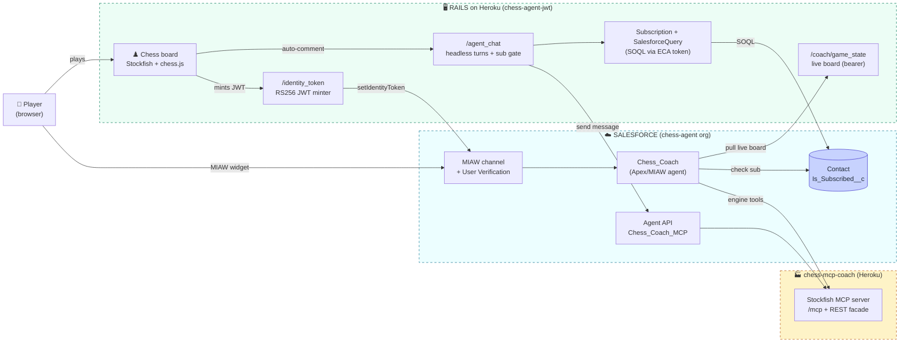
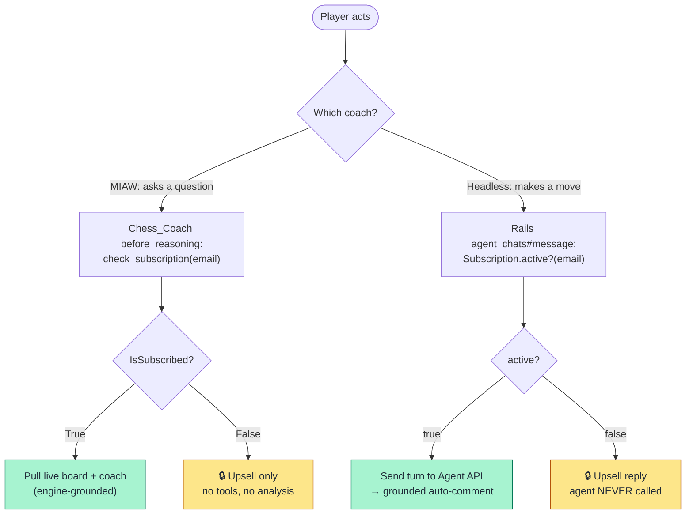
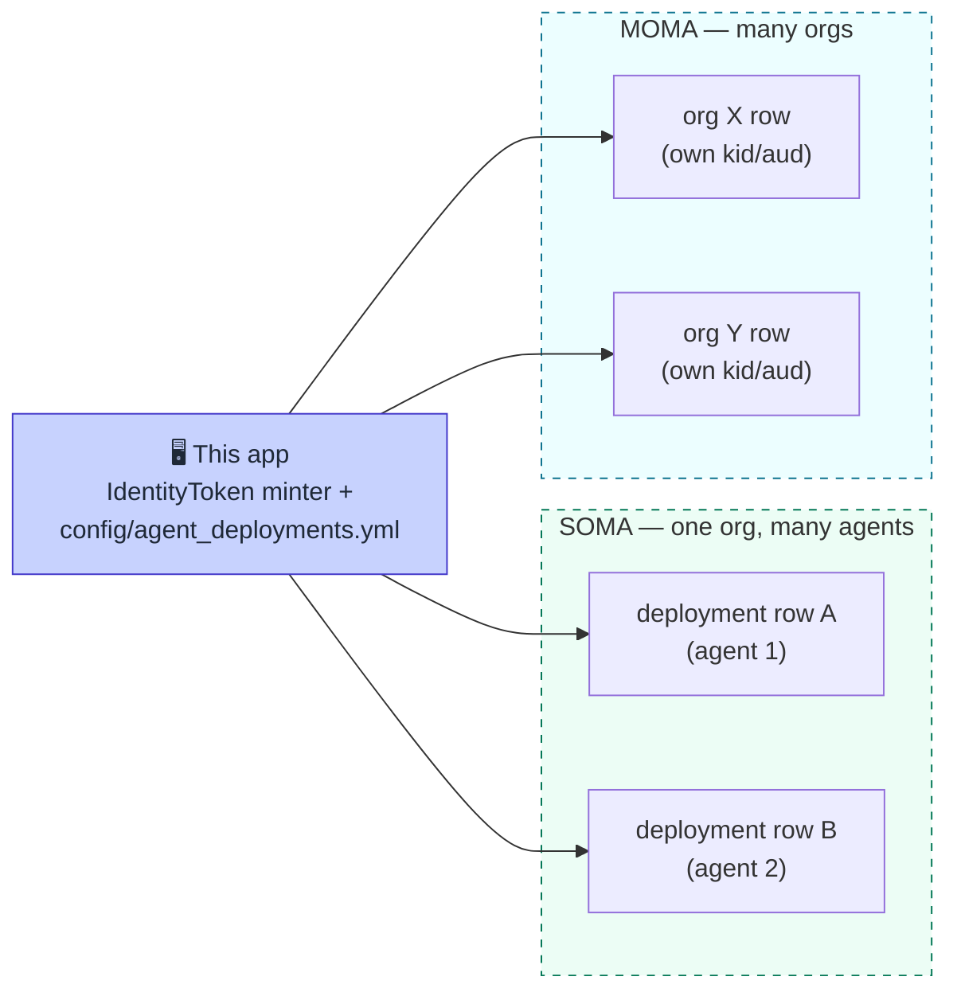

# Architecture & Build — Chess + Agentforce verified-identity coach

What was built and **why**, with diagrams of the auth flow and the SOMA/MOMA generalization,
plus a consolidated "paid for once" gotchas section. This is the explanation file — for the
step-by-step demo, see [`demo-script.md`](demo-script.md); for the deep wiring of two specific
subsystems, see the durable guides referenced inline.

**Last verified:** 2026-06-25.

---

## 1. What this is

A Ruby on Rails chess app (Devise login, client-side Stockfish + chess.js) that embeds a Salesforce
**Agentforce** chess coach. A logged-in user's identity is passed to Salesforce via a signed **RS256
JWT** (MIAW **User Verification**), so the conversation runs as a *known, verified Contact*. Coaching
is a **paid feature** — gated deterministically on the Contact's subscription — which is the whole
point of carrying verified identity into the chat.

Built as a reusable **SOMA/MOMA** reference (Single/Multi-Org, Multi-Agent): the JWT minting and the
widget embed are config-driven via `config/agent_deployments.yml`, so adding an agent or an org is a
config row, not a code change.

### Two coaches, two delivery models (the user can toggle in-app)

| | **Apex coach → MIAW** | **MCP coach → headless Agent API** |
|---|---|---|
| Surface | Embedded MIAW widget (chat bubble) | Custom in-app chat panel |
| Interaction | **Reactive** — replies when the user asks | **Proactive** — auto-comments after each move |
| Identity | Verified Contact (RS256 JWT → MIAW) | `bypassUser` — agent does **not** know the user |
| Live game state | Per-turn Apex pull from Rails (continuity-trap fix) | Rails embeds FEN in each turn's prompt |
| Engine grounding | Apex → chess REST facade → Stockfish | Native `mcpTool://` (+ same REST facade) |
| Subscription gate | **In-agent** (Apex action + Agent Script `if`) | **In Rails** (SOQL check before the API call) |
| Agent | `Chess_Coach` (AgentforceServiceAgent) | `Chess_Coach_MCP` (ExternalCopilot) |

The hard part was never the chess — it's the **identity handoff** and the fact that the two coaches
have fundamentally different identity models, which ripples into where every cross-cutting concern
(live state, subscription gating) has to live.

---

## 2. System landscape



**ASCII fallback**

```text
 👤 Player ──plays──> [Chess board: Stockfish + chess.js] ───────────┐
    │                                                                │
    │  MIAW widget                          auto-comment after move  │
    ▼                                                                ▼
 ┌──────────── SALESFORCE (chess-agent) ───────────┐   ┌──── RAILS (Heroku) ─────┐
 │ MIAW channel + User Verification                │   │ /identity_token (RS256) │
 │   → Chess_Coach (Apex/MIAW agent)               │<──┤ /coach/game_state       │
 │        ├─ pull live board ─────────────────────────>│ /agent_chat + sub gate  │
 │        ├─ engine tools ──────────┐              │   │ Subscription→SOQL (ECA) │
 │        └─ check_subscription ──> Contact.Is_Subscribed__c <───────┘            │
 │ Agent API → Chess_Coach_MCP ─────┤              │   └─────────────────────────┘
 └──────────────────────────────────┼──────────────┘
                                     ▼
                       [chess-mcp-coach: Stockfish MCP /mcp + REST]
```

---

## 3. The verified-identity handoff (the spine)

The browser never sees the private key; it only ever receives a finished short-lived JWT from an
authenticated endpoint, hands it to the widget, and Salesforce binds the conversation to a Contact.

```mermaid
%%{init: {'theme': 'base', 'themeVariables': {
  'actorBkg': '#ddd6fe', 'actorTextColor': '#1f2937', 'actorBorder': '#6d28d9',
  'signalColor': '#334155', 'signalTextColor': '#1f2937',
  'noteBkgColor': '#f8fafc', 'noteTextColor': '#1f2937', 'noteBorderColor': '#334155'}}}%%
sequenceDiagram
    autonumber
    box rgba(167,243,208,0.3) BROWSER
        participant W as 🌐 MIAW widget
        participant C as ⚙️ agentforce_controller
    end
    box rgba(221,214,254,0.3) RAILS
        participant R as 🖥️ /identity_token
    end
    box rgba(165,243,252,0.3) SALESFORCE
        participant S as ☁️ MIAW / SCRT2
        participant A as 🤖 Chess_Coach
    end

    Note over W,A: Verified-identity handoff (RS256 User Verification)
    W->>C: onEmbeddedMessagingReady
    C->>R: GET /identity_token?deployment=… (Devise session)
    Note over R: sign RS256 JWT — sub=email, iss, aud, kid<br/>(no-store; never HTTP-cached)
    R-->>C: { identityTokenType:"JWT", identityToken }
    C->>S: userVerificationAPI.setIdentityToken(JWT)
    Note over S: verify vs keyset (issuer+kid+x5c)<br/>via the ACTIVE AuthScheme
    S->>S: bind conversation → AUTH/uid:email → Contact
    S->>A: route the verified conversation

    alt Token expires (every ~5 min)
        S-->>C: onEmbeddedMessagingIdentityTokenExpired
        C->>R: re-mint within 30s (guarded vs storm)
        C->>S: setIdentityToken(fresh JWT)
    end

    alt Sign-out / New chat
        C->>S: clearSession({shouldEndSession:true})
        Note over C,S: "New chat" mints a UNIQUE subject (local+r<nonce>@domain)<br/>to escape the verified-conversation continuity trap
    end
```

**ASCII fallback**

```text
Browser(widget)        agentforce_ctrl       Rails /identity_token     Salesforce MIAW/SCRT2
      │ onReady ─────────────>│                                              │
      │                       │ GET /identity_token (Devise) ───────────────>│ (Rails)
      │                       │<── RS256 JWT {sub=email,iss,aud,kid} ─────────│
      │ setIdentityToken(JWT) ───────────────────────────────────────────────>│
      │                       │              verify vs keyset (issuer+kid+x5c)│
      │                       │              via ACTIVE AuthScheme → Contact  │
      │                       │              route verified convo → Chess_Coach
      │  ── on expiry: re-mint within 30s (guarded) ── │
      │  ── sign-out/New chat: clearSession; unique sub escapes continuity ── │
```

Deep dive: **[`agentforce-user-verification-guide.md`](agentforce-user-verification-guide.md)** — the
exact JWT claim set, the JWK-needs-`x5c` gotcha, and the AuthScheme that actually links the keyset to
the channel.

---

## 4. Where state and gating live (the consequence of two identity models)

Because the headless Agent API session is `bypassUser`, the agent **cannot see who the player is** —
so anything that depends on identity has to be solved differently per coach:

- **Live game state.** MIAW's hidden-prechat pipeline is consumed only at conversation *creation*, and
  a verified user has ONE persistent conversation that every open *resumes* — so prechat goes stale
  (the **continuity trap**). Fix: the agent calls an Apex action (`ChessCoachGetLiveGame`) every turn
  that pulls the current board from Rails (`/coach/game_state?email=`). The headless coach has no such
  problem — Rails composes each turn's prompt with the live FEN directly. Deep dive:
  **[`miaw-prechat-to-agent-guide.md`](miaw-prechat-to-agent-guide.md)**.
- **Subscription gate.** Single source of truth = `Contact.Is_Subscribed__c`. MIAW gates **in-agent**
  (`ChessCoachCheckSubscription` Apex → Agent Script `if @variables.IsSubscribed == True`); headless
  gates **in Rails** (`Subscription.active?(email)` SOQL via the ECA token, *before* the Agent API
  call — so an unsubscribed user costs zero agent turns). Both **fail closed**.



---

## 5. SOMA / MOMA generalization



One signer serves everything: the minter reads `issuer`/`audience`/`key_id`/`token_ttl_seconds` per
deployment, and the embed reads `org_id`/`deployment_name`/`site_url`/`scrt2_url`. Adding an agent
(SOMA) or an org (MOMA) is a new row in `config/agent_deployments.yml` plus registering the public key
in that org — no code change. The `mode:` discriminator (`miaw` vs `agent_api`) selects the path.

---

## 6. Gotchas — paid for once

Hard-won lessons; the two with their own guides are summarized here and linked for the full story.

- **JWK needs `x5c`, or every conversation is silently UNAUTH.** A JWK with only `kty/kid/alg/n/e`
  uploads fine but never validates tokens — conversations bind as Guest with `ContactId = null`. Add
  an X.509 cert (`x5c`) generated from the existing private key. *(user-verification guide)*
- **The AuthScheme is the real keyset↔channel link.** The "Add User Verification" checkbox only sets
  `authMode=Auth`; without an **active AuthScheme** (created in Messaging Settings UI, not deployable
  metadata) referencing the keyset, every token exchange fails *before* the signature is checked
  ("no active AuthSchemes"). *(user-verification guide)*
- **A Setup field can be hidden by the wrong edit entry point.** "Add User Verification" is absent on
  the section-level pencil but present via full **row Edit** from the channel list view. Rule of
  thumb: re-open via full Edit before concluding a feature doesn't exist.
- **Don't HTTP-cache the token endpoint.** Rails' `Rack::ETag` → `304` → the browser reuses a stale,
  expired token. Set `Cache-Control: no-store` **and** `Last-Modified` (so Rack skips the ETag). Guard
  the `onEmbeddedMessagingIdentityTokenExpired` handler against a re-mint storm.
- **The verified-conversation continuity trap.** A verified user has ONE conversation that every open
  resumes; hidden prechat is consumed only at creation, so it goes stale. Two fixes shipped: a
  per-turn Apex **pull** for live state, and a **unique-subject** JWT (`local+r<nonce>@domain`) for
  the "New chat" reset. *(prechat guide)*
- **`@MessagingEndUser.ContactId` arrives NULL in agent context at reasoning time** — even when the
  conversation is verified. Key agent actions on the **prechat email**, not ContactId. *(prechat guide)*
- **MCP §8: never source-publish the MCP agent.** Native `mcpTool://` actions must be added in the
  **builder** — `sf agent publish authoring-bundle` overwrites the builder draft and the tools end up
  in metadata but off the planner menu (validate clean, never fire). The Apex/MIAW agent
  (`Chess_Coach`) is safe to source-publish; `Chess_Coach_MCP` is not.
- **An agent change isn't live until publish + activate — verify the COMPILED ACTIVE version.** The
  subscription gate looked done but didn't fire because the active version was still pre-gate. Confirm
  by decoding the active planner graph (`GenAiPlannerBundle` → base64 `_graph.json`) for your change;
  source edits + Apex deploy are necessary but not sufficient.
- **Agent API buffers the whole turn.** `/messages/stream` emits every event (including the reply) in
  one burst at `END_OF_TURN` — there is no progressive text, so a token-streaming UI buys nothing. The
  ~8s/turn floor is planner-LLM generation, roughly linear in reply length (hence the brevity
  directive in the headless prompt).
- **This Stockfish build supports `Skill Level`, not `UCI_Elo`.** The vendored asm.js engine's option
  list has no `UCI_LimitStrength`/`UCI_Elo` — an Elo handicap silently no-ops. The level picker uses
  `Skill Level` (0–20) for the opponent's move while the eval bar stays full-strength.
- **`McpServerDefinition` API name: alphanumeric, 2–40 chars, no underscores** (`Chess_MCP` rejected,
  `ChessMCP` ok). Trust the raw Tooling REST API for these Beta entities, not the CLI SOQL wrapper.

---

## 7. Stack

Rails 8 · Devise · Hotwired (Turbo + Stimulus, importmap — no bundler) · Tailwind v4 · client-side
Stockfish (WASM) + chess.js · Salesforce Agentforce + MIAW · Heroku (Postgres + Solid Cache/Queue).
A separate Node MCP server (Stockfish over Streamable HTTP) lives in `chess-mcp/` on its own dyno.

## 8. Reading order for a new contributor

1. This file — the what/why + diagrams.
2. **`build-log.md`** — the append-only narrative (every dead end and gotcha, dated).
3. **`agentforce-user-verification-guide.md`** + **`miaw-prechat-to-agent-guide.md`** — the two
   deepest subsystems, findable by name.
4. **`demo-script.md`** — to actually run the demo.
5. `skills/` — the two reusable Claude Code skills distilled from this build.
