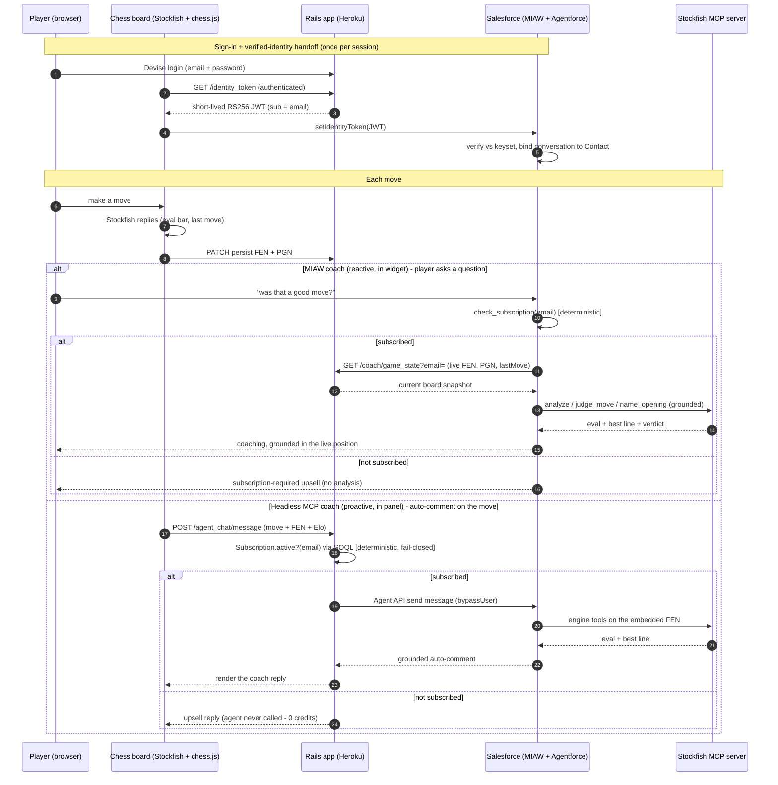
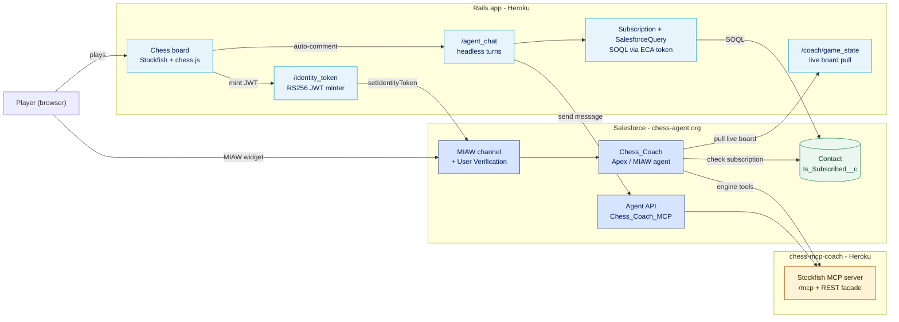

# Architecture diagram — data & usage flow (Lucidchart-ready)

Two Mermaid diagrams of how data flows when a player uses the app + coaching agent, written to
**import cleanly into Lucidchart** and then be restyled with official Salesforce brand assets.

- **Diagram 1 — Runtime data/usage flow** (sequence): what happens on a single play-and-coach turn.
- **Diagram 2 — Component landscape** (flowchart): the systems and how they connect, brand-colored.

> **Why Mermaid for Lucid?** No Lucidchart MCP/plugin is installed, but **Lucidchart imports Mermaid
> natively into editable shapes**. The blocks below are kept *Lucid-safe* (no `%%{init}%%` theme
> directives, no emojis, no `box` groupings — Lucid's importer trips on those). Colors ride in via
> `classDef`, which Lucid honors. After import you drop the real Salesforce logos/icons on the shapes
> (see §3).

**Last verified:** 2026-06-26.

---

## 1. Import into Lucidchart (steps)

1. In a Lucidchart doc: **Insert → Diagram via Markdown** (a.k.a. the Mermaid/Markdown import). In
   some versions it's **File → Import → Mermaid**, or the **Mermaid** shape in the shape library.
2. Paste **one** diagram's fenced block contents (the text *inside* the ```` ```mermaid ```` fence —
   not the backticks).
3. Lucid renders it as **native, editable shapes** (not an image). Repeat for the second diagram.
4. Restyle with brand assets per §3.

> If the sequence diagram (Diagram 1) doesn't import in your Lucid plan, use Diagram 2 (flowchart) —
> flowchart import is the most universally supported — and treat Diagram 1 as the written
> step-by-step it already is.

---

## 2. The diagrams

### Diagram 1 — Runtime data/usage flow (one play-and-coach turn)



### Diagram 2 — Component landscape (brand-colored)



---

## 3. Brand the imported diagram (official Salesforce assets)

After import, the shapes are generic. To make it read as authentically Salesforce, drop the **real
asset files** onto the shapes (drag the file into Lucidchart, or Insert → Image). Source of truth is
the `applying-salesforce-brand` skill's `assets/` folder — **use the original files, don't redraw**:

| Shape | Asset to place | File (under `~/.claude/skills/applying-salesforce-brand/assets/`) |
|---|---|---|
| **Salesforce** subgraph header | Salesforce Cloud logo | `Logo/Main Salesforce Cloud - Primary.svg` |
| **Chess_Coach / Agent API** nodes | Agentforce product logo | `Product Logos/Agentforce (Product).png` |
| The agent / AI moment | **Agent Astro** (AI mascot, sunglasses) | `Carachters/Agent Astro/Astrobot_Sunglasses_AFlip_009_2K.png` |
| Value/■ accents (optional) | 3D storytelling icons | `Icons/Acceleration-3D-Storytelling-Icon-preview *.png` |

**Colors** (already applied via `classDef`, match these if you restyle in Lucid):

| Token | Hex | Use |
|---|---|---|
| Salesforce dark blue | `#001E5B` | Salesforce nodes, all heading text |
| Cloud blue | `#0D9DDA` | Rails node borders / accents |
| Amber | `#B45309` | MCP server (self-hosted, non-SF) |
| Green | `#1B7F4B` | the Contact datastore (source of truth) |

**Type:** headings in **AvantGarde**, body/labels in **Salesforce Sans** (both in the skill's
`assets/Fonts/`) if you want full brand type in Lucid.

> Logo rule (from the brand system): use only `Logo/Main Salesforce Cloud - Primary.svg` and **do not
> recolor it** with filters. Brand assets are Salesforce-internal — for internal/authorized use.

---

## 4. Alternatives considered

- **Lucidchart MCP/plugin** — none installed in this environment, so I can't push shapes directly
  into a Lucid doc; Mermaid import is the cleanest editable path and matches the Lucid preference.
- **Rendered PNG** (`generating-visual-diagrams` skill, Nano Banana Pro via Gemini CLI) — produces a
  polished, slide-ready image with the logos baked in, but it's **not editable** in Lucid and needs a
  Gemini CLI/API-key setup. Good for a deck; say the word and I'll generate one.
- These diagrams also live in prose form in [`architecture-and-build.md`](architecture-and-build.md)
  (system landscape + handoff sequence) for the repo's GitHub view.
