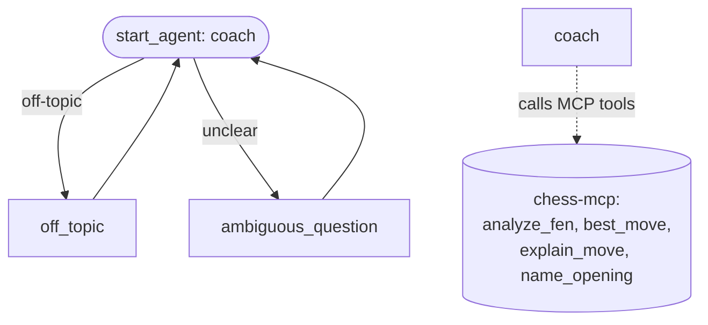

# Agent Spec — Chess Coach

## Purpose & Scope

A **chess coaching** service agent embedded in the chess web app via Messaging for In-App and
Web (MIAW). It coaches the *currently logged-in, verified* player about the game they're
playing on screen. It is a **full proactive coach**: it greets the verified user by name,
already knows the moves played, explains the position, suggests plans, flags blunders, and
answers chess questions — backed by a real Stockfish engine (the chess MCP server) so its
analysis is engine-accurate, not LLM guesswork.

## Behavioral Intent

- **Verified identity.** The user reaches the chat already verified via the User Verification
  JWT (RS256), mapped to a Contact. The agent greets them by name and speaks as if it knows
  who they are. It must NOT ask the user to identify themselves.
- **Game awareness.** On chat open, the app passes the live game state as hidden prechat
  fields → conversation variables: `Chess_PGN`, `Chess_FEN`, `Chess_Turn`, `Chess_Move_Count`,
  `Chess_Status`. The agent uses these as the position-of-record; it should reference the moves
  already played without asking the user to restate them.
- **Engine-grounded coaching.** For anything requiring real evaluation (best move, is-this-a-
  blunder, position assessment), the agent calls the chess MCP tools rather than reasoning
  about chess from its own training. It explains the engine's findings in coach-friendly
  language.
- **Proactive but not pushy.** On first contact it offers a brief read of the current position
  and invites a question; it doesn't dump an essay.
- **Scope.** Chess coaching for the current game and general chess questions. Off-topic →
  redirect.

## Configuration

- **Agent type:** `AgentforceServiceAgent` (MIAW-attached).
- **Default agent user:** `chesscoach.agent@chess-agent.demo` (Einstein Agent User, id
  `005g8000004rM6XAAU`, created 2026-06-19; org has 1002 Einstein Agent licenses, 0 used).
- **Permissions verified:** pending (after bundle scaffold — see Agent User Setup).
- **MCP server:** `chess-mcp-coach` live at https://chess-mcp-coach-f6ee6f3510f9.herokuapp.com
  (`/mcp` endpoint, four tools verified). Register in Setup → capture `mcpTool://` dev names.
- **Connection:** `messaging` (MIAW) — links MessagingSession + the conversation variables.

## Conversation Variables

| Variable | Type | Source | Used for |
|---|---|---|---|
| `Chess_PGN` | string | hidden prechat field | the moves played so far (coach references them) |
| `Chess_FEN` | string | hidden prechat field | current position; passed to MCP tools |
| `Chess_Turn` | string | hidden prechat field | "White"/"Black" — whose move it is |
| `Chess_Move_Count` | string | hidden prechat field | how far into the game |
| `Chess_Status` | string | hidden prechat field | "active"/"over" |
| `contactName` | string | MIAW verified-identity / MessagingSession | greet the user by name |

> Exact mechanism for surfacing the verified Contact's name into a variable is a Phase 4
> open item (MessagingSession linkage vs. a routing/Apex lookup). Confirm in-org.

## Subagent Map

Single primary domain subagent + two standard guardrails. Coaching is one coherent domain, so
no hub-and-spoke is needed.

## Actions & Backing Logic

All four are **MCP tools** on the remote chess MCP server (Heroku), invoked via `mcpTool://`.
Status: **NEEDS DEPLOY + REGISTER** — the server exists locally (`chess-mcp/`, tested) but must
be deployed to Heroku and registered as an MCP server in Salesforce Setup before these targets
resolve. Exact `mcpTool://<DeveloperName>` dev names are assigned at registration (Phase 4).

| Action | MCP tool | Inputs | Outputs (coach-visible) |
|---|---|---|---|
| `analyze_position` | `analyze_fen` | `fen` (string), `depth` (int, opt) | evaluation, bestMove, principalVariation |
| `get_best_move` | `best_move` | `fen` (string) | bestMove (SAN + UCI) |
| `judge_move` | `explain_move` | `fen` (before), `move` (SAN/UCI) | verdict, evalSwingCp, engineBestMove |
| `identify_opening` | `name_opening` | `moves` (list[string], SAN) | opening name |

> MCP action I/O declaration syntax in Agent Script is confirmed against the live tool schema
> at registration time. The MCP server already returns JSON with these field names.

## Gating Logic

- **No hard gates needed.** Identity verification is enforced *upstream* by the Rails
  `/identity_token` endpoint + MIAW User Verification — by the time the agent runs, the user is
  already verified. The agent doesn't re-check identity.
- Off-topic / ambiguous handled by guardrail subagents (subjective routing), not deterministic
  gates.

## Open Items (resolve in Phase 4, in-org)

1. Create the Einstein Agent User (service-agent prereq).
2. Deploy chess-mcp to Heroku; register it as an MCP server in Setup; capture the
   `mcpTool://` dev names; confirm MCP action I/O syntax.
3. Confirm how the verified Contact name reaches a conversation variable (`contactName`).
4. Confirm the prechat→conversation-variable mapping field API names on the MIAW channel.
